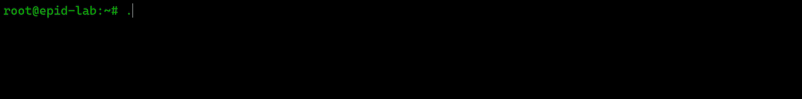

<p align="center">
  
</p>

```text
root@epid-lab:~# cat /etc/motd

██╗ ██╗██╗ ██╗███████╗██████╗ ████████╗ █████╗ ██╗  ██╗
██║ ██║██║ ██║██╔════╝██╔══██╗╚══██╔══╝██╔══██╗██║ ██╔╝
██████║██║ ██║█████╗  ██████╔╝   ██║   ███████║█████╔╝
╚═══██║██║ ██║██╔══╝  ██╔══██╗   ██║   ██╔══██║██╔═██╗
    ██║╚████╔╝███████╗██║  ██║   ██║   ██║  ██║██║  ██╗
    ╚═╝ ╚═══╝ ╚══════╝╚═╝  ╚═╝   ╚═╝   ╚═╝  ╚═╝╚═╝  ╚═╝
```

> Версия ядра: **41.9<!-- age_years (dynamic) -->** (23 года в эпидемиологии)<br>
> Локация: `Якутск, удалённо`<br>
> Статус стенда: `АКТИВЕН`<!-- stand_status (dynamic) --> | Текущая миссия: `ЛИКВИДАЦИЯ ЭПИДЕМИИ`<!-- mission (dynamic) -->

```sh
root@epid-lab:~# whoami
Эпидемиолог с 23-летним стажем, развиваюсь в системном анализе и бэкенд-разработке на Go и Python.
Превращаю хаос предметной области в модели: BPMN, UML, ER и API.
```
```sh
root@epid-lab:~# ls projects/
petra_scandali rogue-go filegate petrushka-system-analysis tb-disinfection-demo
```
```sh
root@epid-lab:~# cat projects/tb-disinfection-demo/status.log
[DEPLOYED] АИС «Дезинфекция» — автоматизация учёта заявок на заключительную дезинфекцию.
[RESOLVED] Разработана BPMN-модель AS-IS/TO-BE и ER-диаграмма.
[COST_SAVED] Время доставки заявки до дезинфектора: с 24 часов до ≤ 5 секунд. Время формирования отчётности: с нескольких часов до ≤ 5 секунд. Потери заявок: исключены полностью (100% учёт)
```
```sh
root@epid-lab:~# cat projects/petrushka-system-analysis/status.log
[PASS] Тестовое задание: Junior Системный аналитик (анализ требований, REST API, архитектура push)
```
```sh
root@epid-lab:~# cat projects/filegate/status.log
[INIT] Микросервис для загрузки и скачивания файлов на Go. Первый коммит: 28 января 2026.
```
```sh
root@epid-lab:~# cat projects/rogue-go/status.log
[DEV] Учебный проект: roguelike-игра на Go. Генерация уровней, логика боя.
```
```sh
root@epid-lab:~# cat projects/petra_scandali/status.log
[COMPLETED] Учебные проекты на C и C++ за время обучения в Школе 21. 340 коммитов.
```
```sh
root@epid-lab:~# grep -E "domain|skills" /etc/profile.json
  "domain": "эпидемиология и инфекционный контроль",
  "skills": [
    "ретроспективный и оперативный анализ (РЭА)",
    "системный анализ (BPMN, UML, ER, требования, API)",
    "разработка (Go, Python, SQL, C/C++)"
  ]
```
---


